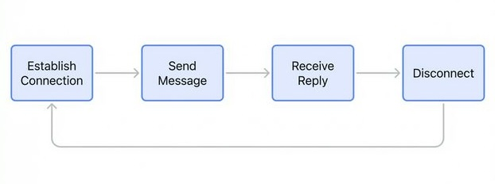
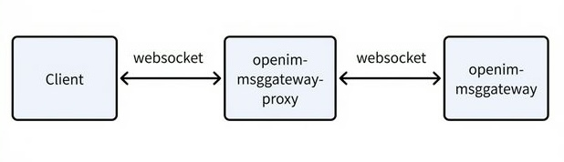
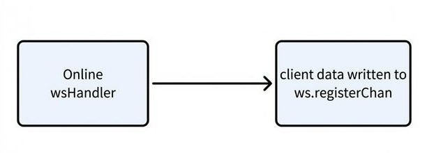
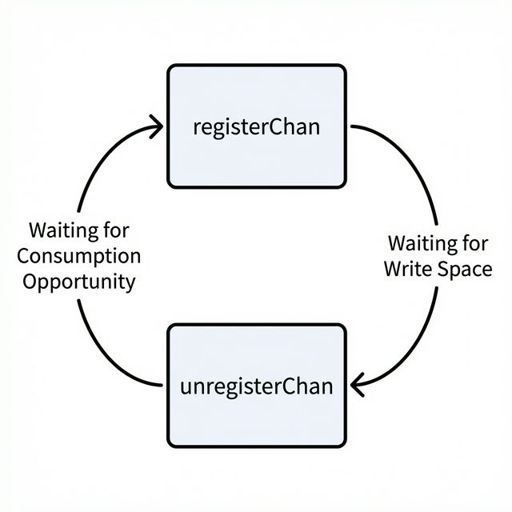

> We deployed [OpenIM](https://github.com/openimsdk) version 3.5.1 in our Kubernetes environment for our company's IM scenarios. During development and operation, we encountered some issues. Here, I'll document the details of the problems and the resolution process.

## Problem Trigger Scenario

We wrote a stress testing program to simulate typical user scenarios:
1. Establish connection (Online)
2. Send message
3. Receive reply
4. Disconnect (Offline)

Test settings: 100 concurrent user accounts, with each account continuously repeating the above process to simulate high-frequency online/offline scenarios.

## Problem Phenomenon
After the stress testing program ran for a while (usually a few minutes to tens of minutes), the following phenomena began to appear:
- New user connection requests had no response, getting stuck at the WebSocket handshake stage.
- Connected users could not go offline normally.
- Server CPU usage was normal, but the number of connections stopped changing.
- The problem temporarily resolved after restarting the `openim-msggateway` service.

## Cause
Conclusion first: The processing of online and offline events caused a deadlock between multiple channels.

Below is the detailed explanation.

To understand this problem, we need to first understand the OpenIM connection link.

"Online" here refers to the OpenIM server accepting a long connection established by the client, which is implemented using WebSocket. Once the long connection is established, the client and server can send messages to each other.

There are two servers on the same client long connection link: `openim-msggateway-proxy` and `openim-msggateway`.

`openim-msggateway-proxy` itself has little business logic; it acts as a load balancer for long connections, facilitating the scaling of `openim-msggateway`.

The problem appeared in `openim-msggateway`, which is the core service responsible for handling message sending and receiving over client long connections.
Specifically, the dependency between `registerChan` and `unregisterChan` in `WsServer` caused a deadlock between consumption and production.

Let's look at the relevant code.

`registerChan` and `unregisterChan` are defined in `WsServer`:
```go
// internal/msggateway/n_ws_server.go
type WsServer struct {
    // ...
	registerChan      chan *Client // Channel for handling online events
	unregisterChan    chan *Client // Channel for handling offline events
    // ...
}
```

Initialized as buffered channels with a size of 1000:
```go
// internal/msggateway/n_ws_server.go
func NewWsServer(globalConfig *config.GlobalConfig, opts ...Option) (*WsServer, error) {
    // ...
	return &WsServer{
		// ...
		registerChan:    make(chan *Client, 1000),
		unregisterChan:  make(chan *Client, 1000),
        // ...
	}, nil
}
```

When a user establishes a websocket connection, it triggers writing data to `ws.registerChan`:
```go
// internal/msggateway/n_ws_server.go
func (ws *WsServer) wsHandler(w http.ResponseWriter, r *http.Request) {
	// Initialize wsLongConn

    // ...

    // Initialize a client
	client := ws.clientPool.Get().(*Client)
	client.ResetClient(connContext, wsLongConn, connContext.GetBackground(), args.Compression, ws, args.Token)

    // Put client into registerChan
    ws.registerChan <- client

    // Start receiving upstream messages
	go client.readMessage()
}
```



When the program starts, it starts a goroutine to consume `ws.registerChan` and `ws.unregisterChan`.


Note ⚠️: In Go's `select` statement, if multiple cases are ready simultaneously, one will be chosen randomly for execution.


```go
// internal/msggateway/n_ws_server.go
func (ws *WsServer) Run(done chan error) error {
    // ...
	go func() {
		for {
			select {
			case <-shutdownDone:
				return
			case client = <-ws.registerChan:
				ws.registerClient(client)
			case client = <-ws.unregisterChan:
				ws.unregisterClient(client)
			}
		}
	}()

    // ...
}
```


The `ws.registerClient` channel will trigger a series of execution chains. Finally, in `WsServer.UnRegister`, the client will be written to the `ws.unregisterClient` channel.
```go
func (ws *WsServer) registerClient(client *Client) {
	oldClients, userOK, clientOK = ws.clients.Get(client.UserID, client.PlatformID)
	if !userOK {
        // ...
	} else {
        // Handling existing online user connections
		ws.multiTerminalLoginChecker(clientOK, oldClients, client)
		// ...
	}
}

func (ws *WsServer) multiTerminalLoginChecker(clientOK bool, oldClients []*Client, newClient *Client) {
	switch ws.globalConfig.MultiLoginPolicy {
	// ...
    // Kick old connections
	case constant.AllLoginButSameTermKick:
		if !clientOK {
			return
		}
		ws.clients.deleteClients(newClient.UserID, oldClients)
		for _, c := range oldClients {
			err := c.KickOnlineMessage()
			// ...
		}
    }

    // ...
}

func (c *Client) KickOnlineMessage() error {
	// ...
	c.close()
	// ...
}

func (c *Client) close() {
	// ...
	c.longConnServer.UnRegister(c)
}

func (ws *WsServer) UnRegister(c *Client) {
	ws.unregisterChan <- c
}
```
Through the above code analysis, we can determine the root cause of the deadlock.

The scenario triggered by the stress testing program is:
1. A large number of users repeatedly go online and offline, frequently triggering the "kick old connection" logic.
2. **Dependencies appear**:
   - Every time a new connection is processed, it triggers an operation to disconnect an old connection.
   - The disconnect operation needs to write to `unregisterChan`.
   - Messages in `unregisterChan` and `registerChan` are processed randomly.
4. **Deadlock forms gradually**:
   - When `registerChan` continuously has data, `unregisterChan` may not get a chance to be processed.
   - `unregisterChan` gradually fills up (capacity of 1000).
   - New "kick old connection" operations start blocking on writing to `unregisterChan`.
   - The online requests being processed cannot complete, and subsequent requests start piling up.
   - Eventually, `registerChan` also fills up, and the system completely freezes.


## Solution
The reason for the deadlock in this scenario is circular dependency, i.e.:
- Consumption of `ws.registerChan` depends on `ws.unregisterChan` having write space.
- Consumption of `ws.unregisterChan` depends on `ws.registerChan` being consumed.



### Core Idea
Separate the processing logic of the two interdependent channels into independent goroutines to eliminate circular waiting.

### Improved Processing Pattern
- **Before**: A single goroutine processed both channels randomly, potentially forming a dependency.
- **Now**: Two independent goroutines process their respective channels in parallel, without affecting each other.

After this improvement:
- Even if `registerChan` has a large amount of pending data, `unregisterChan` can be processed in time.
- The circular dependency is eliminated, avoiding the root cause of the deadlock.
- Concurrent processing capability is improved.


```go
func (ws *WsServer) Run(done chan error) error {
	// ...
	go func() {
		for {
			select {
			case <-shutdownDone:
				return
			case client = <-ws.registerChan:
				ws.registerClient(client)
			}
		}
	}()
	go func() {
		for {
			select {
			case <-shutdownDone:
				return
			case client = <-ws.unregisterChan:
				ws.unregisterClient(client)
			}
		}
	}()
	// ...
}
```

## Summary and Reflection
This problem is only triggered in an edge case, i.e., the same batch of users frequently going online and offline. We also triggered this scenario by coincidence.
Before analyzing the cause of the problem, we were completely confused, only seeing the surface phenomenon and thinking that OpenIM had a major problem.
This problem was difficult to locate. I found the blocked positions of each coroutine by diverting traffic to our local computer and continuously adding logs to the program.
It took almost two days to analyze the problem, but only one minute to write the code to solve it. It was also a magical experience.
