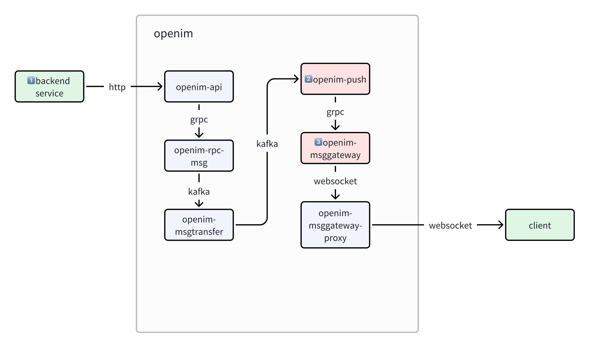

> 公司项目有im场景，我们自己在k8s中部署了3.5.1版本的[openim](https://github.com/openimsdk)，在开发和运维的过程中，我们遇到了一些问题，这里记录一下问题详情和解决的过程。


## 问题触发场景
300个用户同时在线，并不定期单聊发送消息

## 问题现象
从监控指标里可以看到：
- `openimserver-openim-push`和`openimserver-openim-msggateway` 的goroutine数量多
- `openimserver-openim-push`和`openimserver-openim-msggateway` pod socket数很多


## 原因

这看起来像是一个socket泄漏问题，即打开了socket连接，但没有主动关闭，继而引发了协程泄漏。




## 解决办法
```go
// open-im-server/internal/push/push_to_client.go
	for host, userIds := range usersHost {
		tconn, err := p.discov.GetConn(ctx, host)
		if err != nil {
			log.ZError(ctx, "p.discov.GetConn failed", err)
		}

        // 新增以下代码，在使用tconn后关闭
		if tconn != nil {
			defer tconn.Close()
		}
	}
```


## 总结与反思
**关注重要运行指标**: 我们当时是从监控看板及时看到了socket数量异常，排查后发现了这个问题，且后来`openim-msggateway`pod socket占用量最多达到了四万多个。如果没有处理，极端情况下会是pod socket用尽，导致程序异常。

**尽量了解程序实现**: self-host开源项目还是要尽可能的熟悉它的实现，以及时发现问题。

**解决方案不够好**: 正确的实现应该是维护`openim-push`到`openim-msggateway`之间的TCP连接池，这样多次不同的请求可以复用同一批TCP连接，加快调用过程且避免socket资源浪费。
